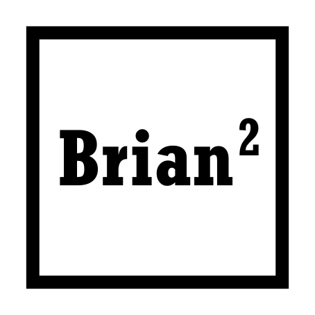

This is where we'll keep our blog for PiWars 2024!

As this is the first post in a new system, let's test out some different
types of content:

## Code Sections

```python
import sys

print(f"This is some example python code: {sys.argv=}")
```

## Content Embeds

### Logo

This is our logo:



### A tweet



### Setion to test workflow

This section I just added to test the deploy workflow
