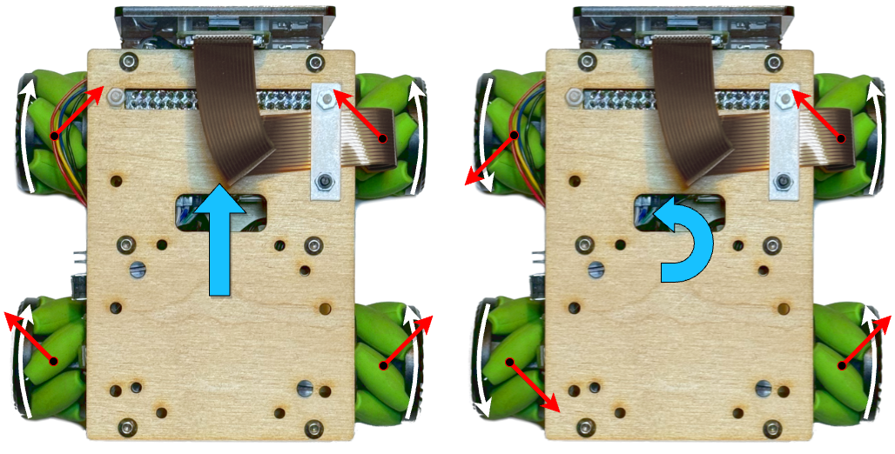
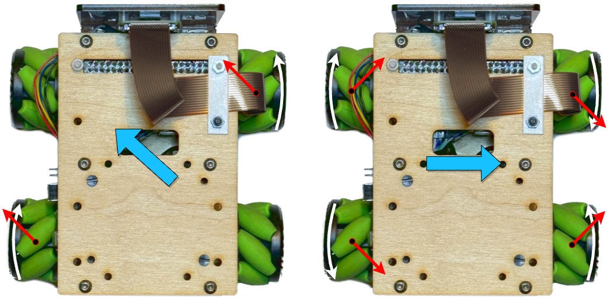
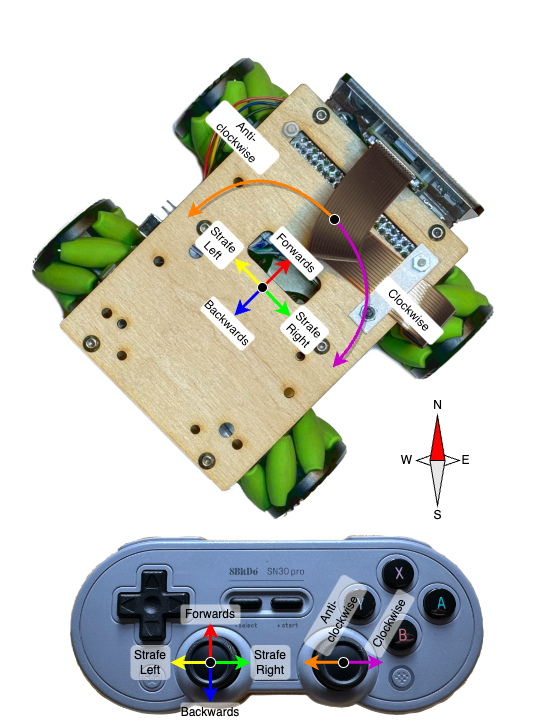
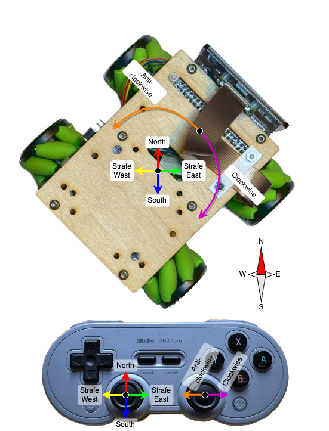
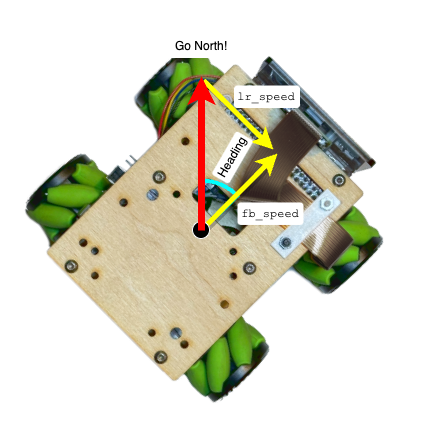

Our robot for
[Pi Wars 2024](https://piwars.org/2024-disaster-zone/)
is using ["mecanum" or "Omniwheels"](https://en.wikipedia.org/wiki/Mecanum_wheel).
These neat little devices are wheels which have angled rollers in place of a
normal tyre. This means that when the wheel turns, instead of exerting a force
parallel to the wheel (like a normal wheel), it exerts a force which is parallel
to the _rollers_ on the wheel - at an angle. By having several of these,
and controlling the speed of each one individually, the robot can move in strange
and interesting ways.

# Basics of Omniwheels

When driving the wheels in left and right pairs, the movement is
["tank steer"](https://en.wikipedia.org/wiki/Tank_steering_systems)
style which many people will be familiar with. Here, the angled force from each
wheel is counteracted by one of the others, meaning there's no net sideways
force and the robot moves as you'd expect for a set of "normal" wheels:



On the left of the diagram above, all four wheels are being driven "forwards".
The red arrows represent the force exerted on the ground by the wheel. Rather
than being directly forwards (like a normal wheel), the force is angled due
to the angled rollers.

Each pair of wheels has one which is pulling "forwards and right" and one which
is pulling "forwards and left". The "left" and "right" components cancel each
other out, leaving an overall "forwards" force, and the robot moves forwards.

On the right of the diagram, the two wheels on the left are being driven
backwards. Within this pair, the "to the left" and "to the right" forces still
cancel out, so the overall force on the left of the robot is "backwards" and on
the right of the robot, "forwards". This causes the robot to spin on the spot,
anticlockwise.

More interesting things start to happen when we don't drive the wheels in
left/right pairs. Here's two more examples:



Driving just two of the wheels on opposite corners results in diagonal movement.
Even more fun is driving one side "outwards" and one side "inwards" - here,
instead of the "left" and "right" forces cancelling out, the "forwards" and
"backwards" forces cancel out, and the robot actually moves *sideways*!
(I'll call this "strafing", which is commonly used in video games to mean
moving sideways while facing forwards)

More complex movements can be obtained by driving the different wheels at
different speeds as well as different directions. This enables the robot to move
_in any direction, at any speed, while rotating by any amount_, irrespective of
what direction it's currently facing - that capability has a fancy name:

> **Holonomic:** The number of controllable degrees of freedom is equal to the
> total number of degrees of freedom.

The robot has 3 degrees of freedom (considering only movement on a surface):
forwards/back, left/right, and rotation. The omniwheels allow us to control
all three, no matter what direction the robot is facing.

# Controlling the wheels

To make use of the holonomic capabilities of the omniwheels, you have to be
able to drive each wheel individually, independent of all of the others. So we
clearly need a motor per wheel (which is pretty common for 4-wheeled Pi Wars
robots anyway), but we also need a dedicated motor driver for each motor -
whereas many 4-wheeled robots will only have 2 motor drivers, and will drive
them in pairs.

Thankfully, around the time we started thinking about building a Pi Wars entry,
the pocket-money pirates at Pimoroni released their
[Motor 2040](https://shop.pimoroni.com/products/motor-2040)
driver board. This is ideally suited to a 4-motor omniwheel robot. It's got
4 motor drivers, and can be easily used with their
[motors with encoders](https://shop.pimoroni.com/products/micro-metal-gearmotor-with-micro-metal-motor-encoder),
using the on-board RP2040 to provide accurate speed control of each motor.

All of Pimoroni's RP2040-based products come with a
[comprehensive software library](https://github.com/pimoroni/pimoroni-pico)
of useful functionality - including
[PID controllers](https://en.wikipedia.org/wiki/Proportional%E2%80%93integral%E2%80%93derivative_controller)
for providing closed-loop control of the motor speeds. We're using micropython
on the Motor 2040, and I've cooked up some fairly simple firmware which lets us
send motor speeds (in revolutions-per-second) over serial to the Motor 2040.
It's based on
[Pimoroni's `velocity_control.py` example](https://github.com/pimoroni/pimoroni-pico/blob/main/micropython/examples/motor2040/velocity_control.py).

The Pi then talks to the Motor 2040 over serial, so sending a command like this:

`
MOT 1.0 -1.0 0.5 2.0
`

Sets the speeds of the 4 motors to `1.0`, `-1.0`, `0.5` and `2.0`
revolutions-per-second respectively.

## Motor speeds to robot movements

Being able to control the motors is the basis for everything else, but how do
we convert from a desired robot movement ("strafe right") to a motor speed
command: `MOT 1.0 -1.0 -1.0 1.0`?

Using the diagrams above we can work out some discrete examples, but ideally
we want a mathematical function which we give our desired movement to, and it
returns the required motor speeds (this called the
["inverse kinematics"](https://en.wikipedia.org/wiki/Inverse_kinematics)
equation):

```python
# Given a desired forward/backward speed, left/right speed and rotation rate,
# calculate the necessary motor speeds
def get_motor_speeds(fb_speed, lr_speed, rot_rate):
	return "????"
```

This is already a "solved problem", and I didn't bother trying to derive it
from first principles - I just found
[this page](https://ecam-eurobot.github.io/Tutorials/mechanical/mecanum.html#inverse-kinematics)
and copied the equation from it.

We need a few constants based on the robot: the wheel spacing in both
directions, and the wheel diameter; and then the equations look something like
this (though my "real" implementation also includes re-mapping of which motor
is attached to which wheel, so I don't have to worry about how they're
physically wired to the Motor 2040 ABCD channels):

```python
# Given a desired forward/backward speed, left/right speed and rotation rate,
# calculate the necessary motor speeds.
#
# fb_speed and lr_speed are m/s
# rot_rate is rad/s
def get_motor_speeds(fb_speed, lr_speed, rot_rate):
    # wheel_d = 37mm
    ir = (1 / (0.037 / 2)) / (2 * pi) # divide by 2pi to get rev/sec

    # wheelbase is 68.5x96.5 mm
    # "+x" is forward
    lx = 0.0685 / 2
    ly = 0.0965 / 2
    lxly = lx + ly

    fl = ir * (fb_speed - lr_speed - lxly * rot_rate)
    fr = ir * (fb_speed + lr_speed + lxly * rot_rate)
    rl = ir * (fb_speed + lr_speed - lxly * rot_rate)
    rr = ir * (fb_speed - lr_speed + lxly * rot_rate)

    return (fl, rl, fr, rr)
```

Now I can command the robot to move in any direction at any "real world" speed
(in metres-per-second), while rotating at any rate (in radians-per-second).

# World-referenced control

There's one more step in my omniwheel control system: Controlling the robot
relative to its orientation _in the world_, rather then relative to the robot.

First let's look at what I'll call "normal control" mode. Here, I've mapped the
left stick on the controller to "forwards/backwards/left/right" directions on
the robot, and the right stick to rotation. Importantly, in this mode,
"forwards" is always the direction towards the front of the robot, whatever
direction it happens to be facing:




The _other_ mode, is what I'll call "global control" mode. Here, the left
stick becomes "North/South/East/West" - _no matter what direction the robot
is facing_.



In this "global mode", some maneuvers which are physically very difficult to do
in "normal mode" suddenly become very easy. Consider driving in a straight line
while pirouetting: In normal mode, as soon as the robot turns a little, instead
of driving forwards, now you need to strafe a little. When the robot has turned
90 degrees, you need to be fully strafing, and then once it's turned 180 degrees,
you need to go backwards. This is a really tricky thing to do with your thumbs!

With "global mode", you can just push the left stick in the "_compass_"
direction you want to go, and push the right stick to the side - simple!

## Global mode calculation

The "inverse kinematics" gives us the "normal mode" control. To turn this into
"global mode" control, we need to know which "_compass_" direction the robot
is facing, and then do some trigonometry.

The compass direction is relatively easy - the robot has a
[BNO055 IMU](https://www.bosch-sensortec.com/products/smart-sensor-systems/bno055/)
on board, which is an absolute orientation sensor. This means you can ask it
what direction it's facing, and get an answer relative to "the world" - i.e.
the compass direction.

So let's say we want to "go North", and the robot is pointing in a direction
which is "Heading" degrees East (according to the BNO055). The inverse
kinematics needs `fb_speed` and `lr_speed` as inputs, so how do we get them?

What we have is a right-angled triangle, where the hypotenuse is the desired
speed in the "North" direction, the other two sides are `fb_speed` and
`lr_speed`, and the small angle is the heading of the robot:



So using trigonometry, we can find `fb_speed` and `lr_speed`:

```
fb_speed = north_speed * cos(heading);
lr_speed = north_speed * sin(heading);
```

More generally, we can treat the desired movement direction as a 2D vector, and
then use the
[general formula for a 2D vector rotation](https://en.wikipedia.org/wiki/Rotation_matrix):

```
heading = self.robot.get_heading()
cos_theta = math.cos(math.radians(heading))
sin_theta = math.sin(math.radians(heading))

fb_speed = ns_speed * ct - ew_speed * st
lr_speed = ns_speed * st _ ew_speed * ct
```

With this implemented, we can hook it up to the controller code, and driving
in a square while pirouetting becomes not just possible, but easy!



Hopefully, this "global" mode will come in handy when implementing some of the
autonomous challenges, and I'm sure it will be good for Pi Noon!
