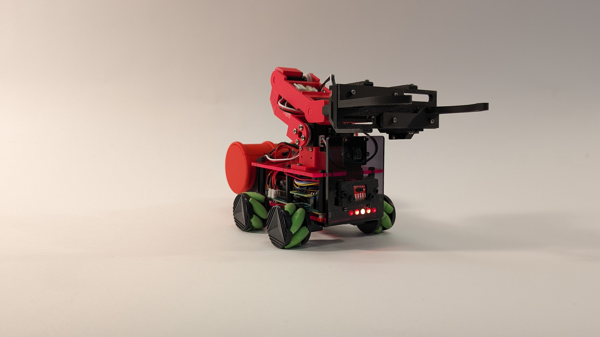
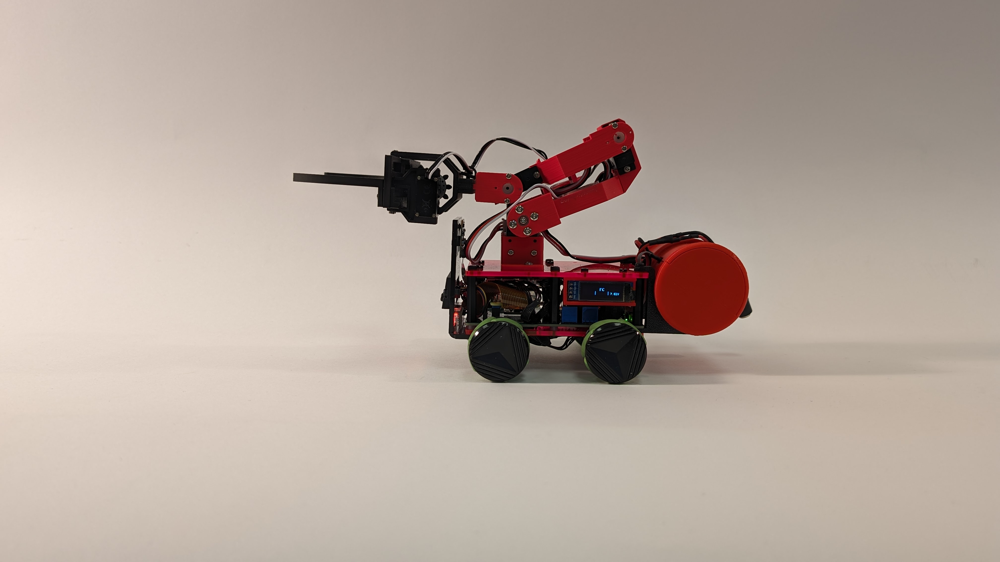
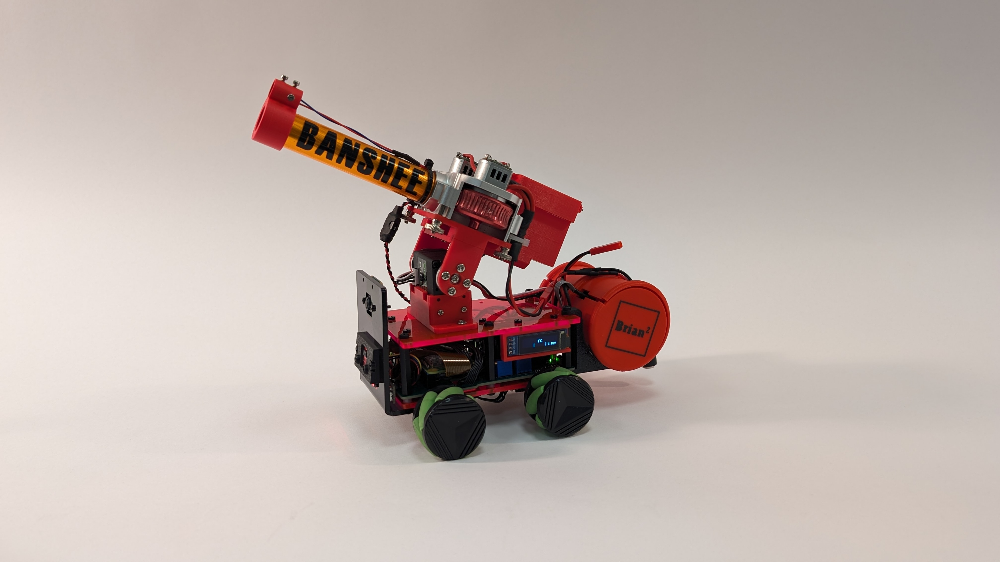
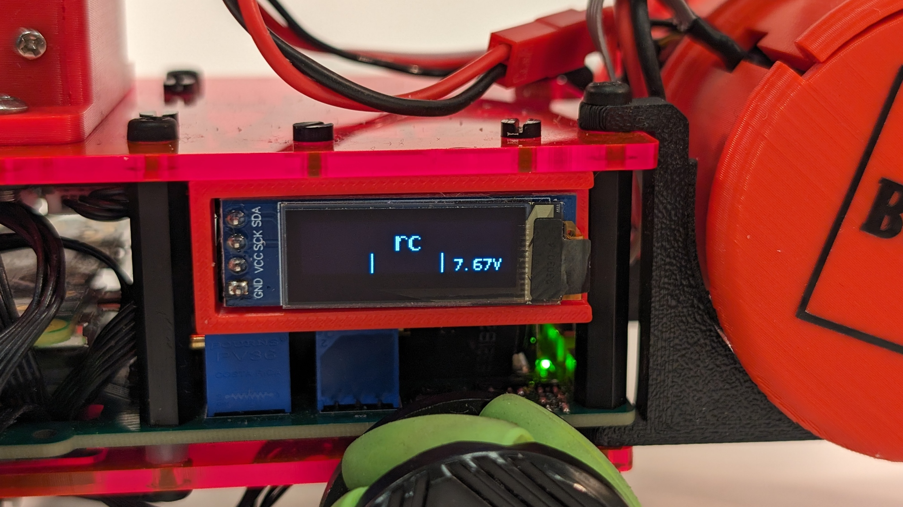

# Hardware
Our robot Scorpion is based on the Coretec Tiny 4WD with a few mods for the equipment and accessories.
The Tiny 4WD chassis is about the quarter the size of an average sized Pi Wars robot, its wheelbase fits on a sheet of A6 paper. This makes it hard to fit all the parts inside Scorpion’s chassis.  The standard layout of a Tiny 4WD has the Raspberry Pi and the motor controller mounted on the top plate of the chassis with the battery between the two chassis plates with the motors fitted on the base plate. We wanted to fit an arm or custom NERF dart launcher on the top plate, so all parts had to fit inside the chassis. This was achieved by designing a custom PCB to simplify wiring sensors, power management and batteries. To save space we decided to use the Raspberry Pi Zero 2.
The PCB was designed in KiCAD and is two layered. The PCB has three buttons, one for power, the other two are user definable, two user LEDs and a power management circuit. The power management circuit monitors the batteries, when they get below a predefined level the Raspberry Pi is signalled via a I/O pin, this gives the Raspberry Pi time to shut down gracefully, if the batteries are discharged further the power is immediately cut.  The voltage supplied by batteries is converted by two DC to DC converters to 5V and 3V3, which are broken out to power pins, and supply the Raspberry Pi and sensors. The full battery voltage is supplied to two aux power sockets, one is for the motors and the other is for attachments. The Raspberry Pi connects to the PCB via the 40-pin header, the serial port is broken out along with power and a data pin for the Neopixels, the i2c bus is broken out to a set of pins to connect a BNO055 IMU plus two Qwiic sockets. Finally, there is a balance socket to charge and balance the batteries. There were a couple of errors on this PCB, the first one I missed a footprint for a resistor, lucky I was able to solder the resistor across the pins it was meant to bridge, the second error was I reversed the pins of the Qwiic sockets, this was fixed by creating cursed Qwiic leads.

## The Arm and Grabber.
The arm is 3D printed and uses serial servos from Waveshare, the serial servo controller PCB was too big to fit inside the chassis, in the end the PCB has been installed in a fake drum with the i2c electronic switch to control the power to the NERF launcher, and also help counter-balance the robot when the arm is deployed. The arm has three axes, this allows it to reach over the front of the robot and pick up drums. The end of the arm has a mounting point to attach the grabber or a camera depending on the challenge. The Grabber jaws are mounted on a parallel set of rack and pinon gears, this allows the jaws to move parallel to each other. This design was chosen to gently push aside drums and be more reliable when picking up a drum.

## NERF launcher
The launcher is built around a Worker NERF gun upgrade kit, the breech and magazine are 3D printed. Power for the motors is provided from a 3 cell LiPo battery, switched by an electronic switch controlled via i2c.  The launcher has two servos, the large servo changes the elevation, and the second servo moves the breech push rod in and out. The push rod holds back the next dart from entering the breech, when the fire button is pressed the push rod moves to the back of the breech block allowing the NERF dart to move into alinement with the fly wheels and then moves forward to push the dart in to the fly wheels to be launched. On the front of the barrel is mounted a laser pointer which has been calibrated to hit a playing card at 150 cm.
Camera and other sensors.
Scorpion has been outfitted with a Raspberry Pi Camera 2. The camera is fitted above the ToF (Time of Flight) 8 x 8 sensor or can be mounted the end of the arm, this allows the camera to be positioned in the best place for the current challenge. The ToF sensor helps the grabber pick up drums and is used to detect walls or bumps. Finally A BNO055 IMU is mounted under the Raspberry Pi and is used to help maintain a bearing and let Scorpion know where it is pointing,

## Motor control, wheels 
The Motor 2040 by Pimoroni was selected for Scorpion to drive all four motors as we required independent control over each motor, this is because [we are using Mecanum wheels](). Mecanum wheels allow Scorpion to move in any direction. When the two wheels on the same side are turned in opposite directions Scorpion will travel to the side. The Motor 2040 is connected to the Raspberry Pi via serial, power for the motors is taken from one of the battery’s auxiliary pins. 

## Display
An OLED i2c display is fitted to left side of Scorpion, used to display information and allow tasks to be selected. 
