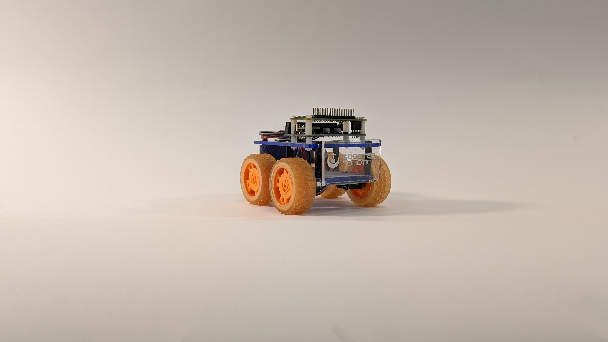
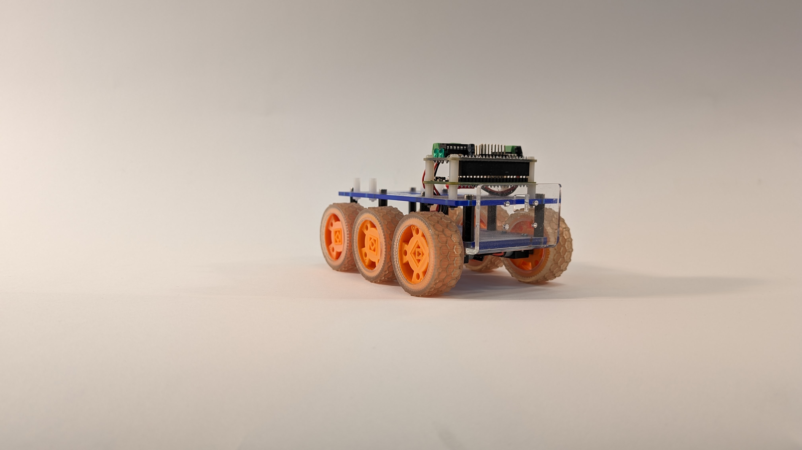
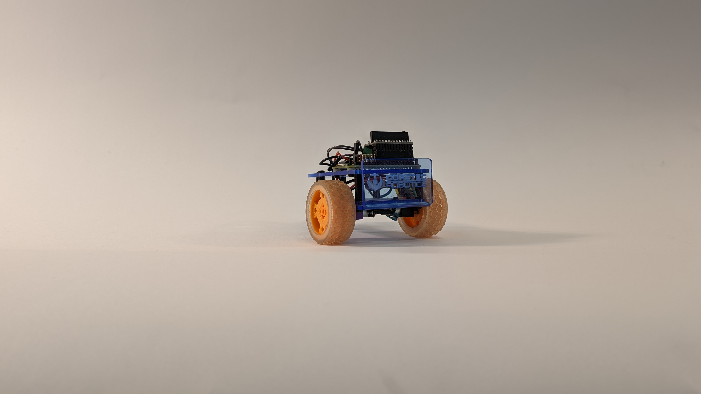
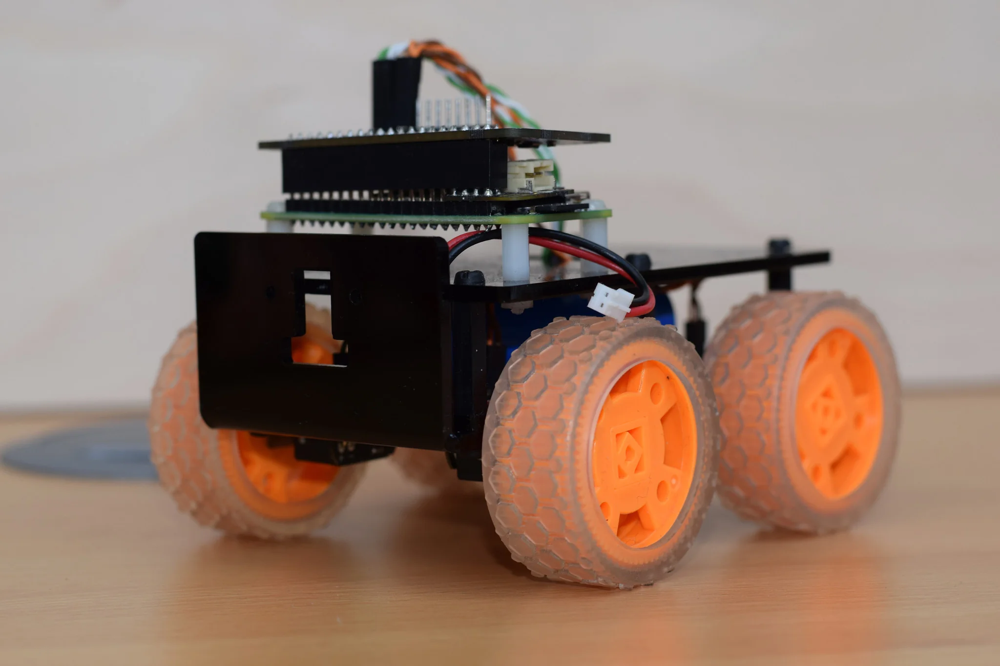
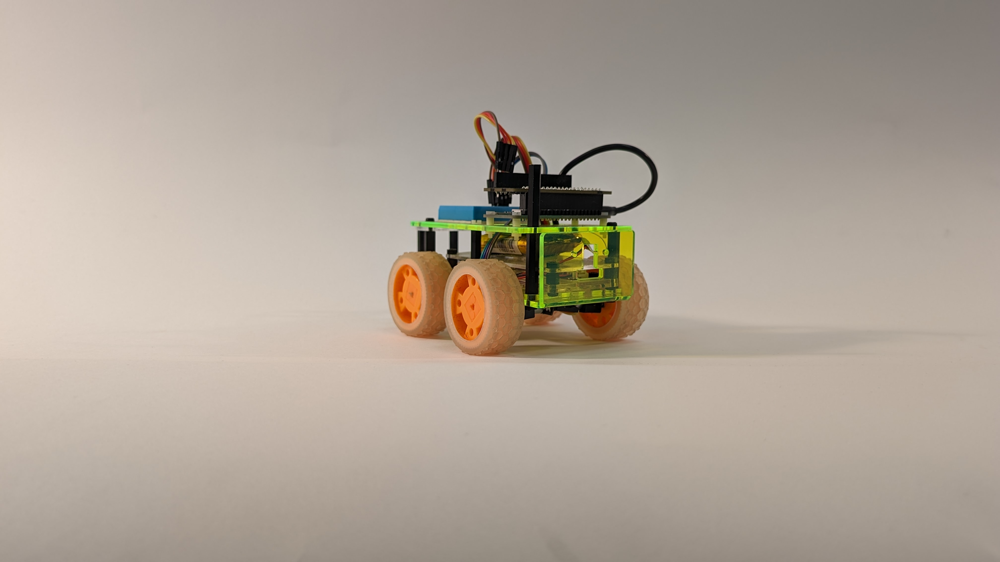
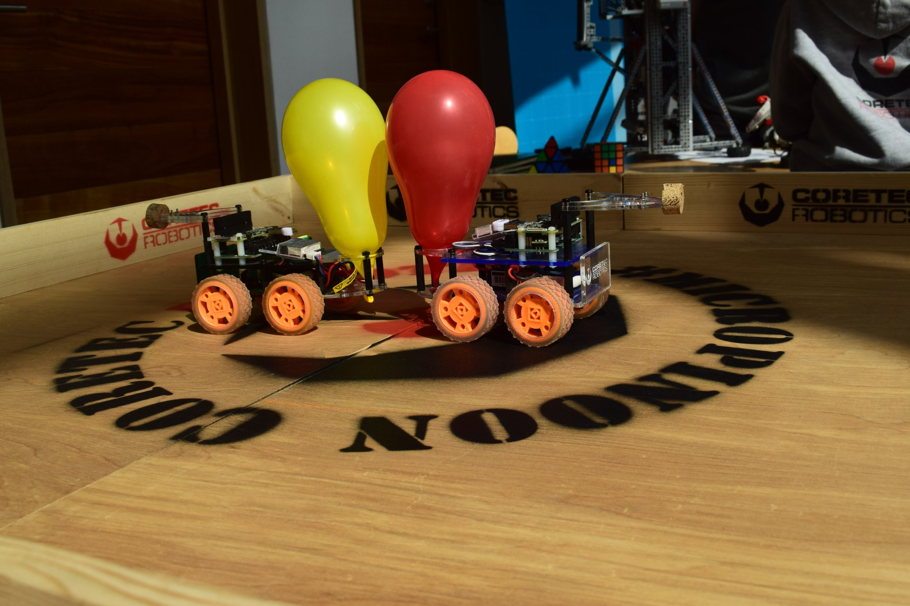
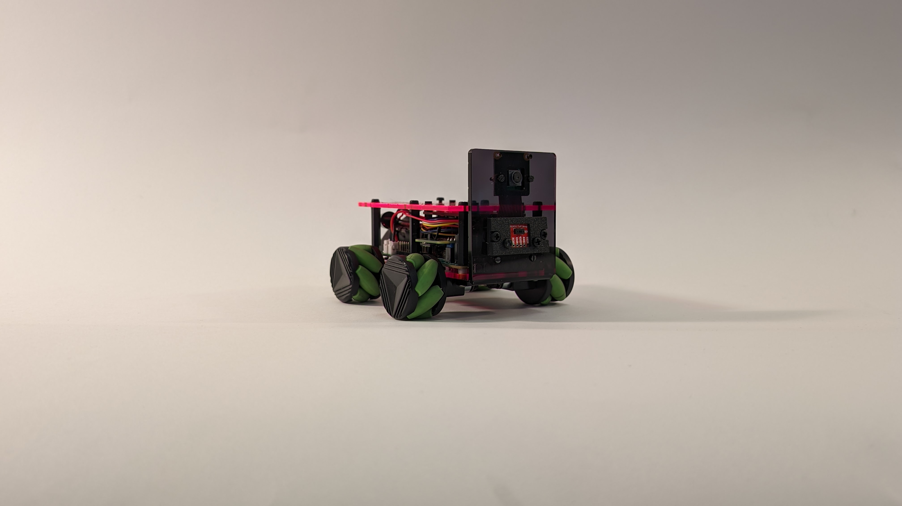

The first Tiny was created for the MagPi mag for a robotics feature written by myself on how to design and create a robot able to compete in Pi Wars, I first pitched a larger robot, but I was asked to create more cost-effective design.

## Design

Tiny was based on a six wheeled robot I made using n20 motors. The chassis was made from two layers of 3mm acrylic separated by 3mm PCB spacers. This creates a box which is many times stronger than a single 6mm plate. The motors were attached to the bottom plate, the Raspberry Pi and motor driver is attached to the top plate, with the battery sitting between the two plates. A bent acrylic plate is attached to the front of the robot and has fixings for a Raspberry Pi camera. To make the MagPi robot more affordable, two of the motors and wheels were removed and the chassis shortened. All kit versions of the Tiny 4WD are 10mm longer than the original Tiny, as it was a little unstable and liked to pull wheelies. 
The Tiny 4WD is a classic 4WD drive rover design and was first designed to turn using skid steering. Skid steering pairs the motors on one side together. By changing the speed and/or the direction of the motors the rover can travel forward/backwards and steer. Some later versions of Tiny have a four-channel motor controller, with omnidirectional wheels fitted and can travel in any direction including side to side. Other design variations include tracked and two wheels versions with a castor wheel.

## Kit Verson

When visiting the Pimoroni pirates, it was suggested that I should release a version of Tiny as a kit for people to buy. Pimoroni stocked a Tiny 4WD kit and offered it in any colour as long it was black! I also sold the Pimoroni kit directly and I also offered a custom Tiny 4WD that had a few improved features and was available in more than a single colour. 

## Mirco Pi Noon

I pinched the Pi Noon challenge from Pi Wars and designed a pin mount plus a balloon holder. A fleet of Tiny 4WDs have been taken to Raspberry Jams, STEM/STEAM events, maker festivals across the UK and even a pair were made for the Berlin Raspberry Jam.

## Pi Wars Past and Present 

The Tiny 4WD has always had a close relationship to Pi Wars being launched at the 2016 event and has been used by beginners to advanced teams. One Tiny-based robot was completely autonomous, Mark Mellors’ Piradigm.
This Pi Wars I will be finally entering my own Tiny 4WD in Pi Wars with Brian S. Our Tiny 4WD has several customisations from a standard Tiny. We are using the Pimoroni Motor 2040 for the motor/servo controller with n20 motors with encoders and depending on the challenge we may swap out omnidirectional wheels for moon buggy wheels. Sensors include a Pi Camera up front with a Sparkfun breakout of an 8 x 8 ToF sensor and a BNO055 IMU. I will be designing a custom PCB for power distribution and management. “Scorpion” is the name of our robot will have an articulated claw to grab toxic drums and hold our zombie gun.

* This post was written late last year and was meant to be posted back then! Only 4 months late.

